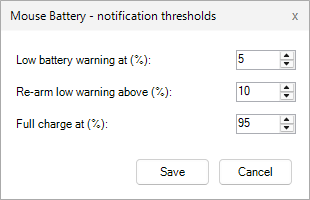
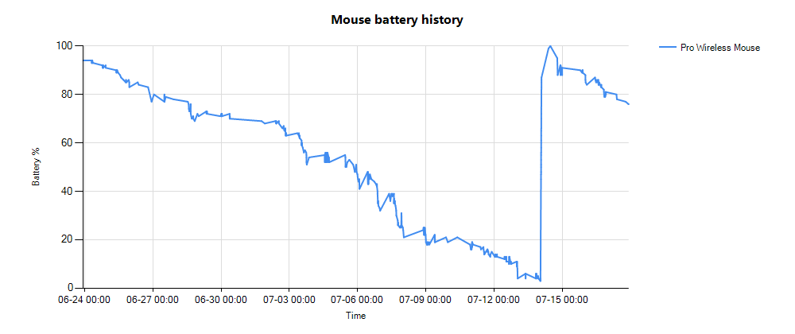

# mousebat

Logitech's G HUB knows how much battery your wireless mouse has left. The catch is
that seeing the number means running G HUB, a fat background service with a login,
for one integer. I wanted the integer and none of the rest. So mousebat reads the
battery straight off the receiver over HID++ and paints it as a little battery in
the tray. About 30 KB, nothing to install, and G HUB can stay shut.

It also nags you at the moments that actually matter: when you're about to run out,
and when it's been charging long enough that you should unplug it.

## Screenshots

The tray icon is a live battery. Fill height is the charge, colour is the level:


Double-click it for the thresholds dialog, and there's a history chart:

 

## How it works

The battery comes over HID++, read directly from the receiver, which is why G HUB
can be closed the whole time. If that comes back empty while G HUB happens to be
running, mousebat borrows the answer from G HUB's local websocket instead. A wireless
mouse only reports its battery while it's awake, so the last good reading is cached
and shown while it sleeps. The whole thing runs headless, started once at login.

The icon earns its keep. Fill height tracks the charge, colour goes green, amber then
red as it drops, and it moves: a wave rising up the battery while charging, a slow
pulse when it's low or topped off.

The nudges repeat while the situation lasts, and get more insistent as it gets worse.
All the numbers below are yours to change:

- **Low.** Under the low mark (5% by default) and discharging, it re-nudges every 1%
  you lose. Between there and the re-arm level (10%), every 5%.
- **Critical.** At 1% it stops being polite and nudges every 15 seconds.
- **Full.** Charging and sitting at 95% or more, it reminds you every 5 minutes to
  pull the cable.
- **Fast drain.** When your recent active drain runs well above your normal rate. It
  ignores sleep time, so a lazy day and a heavy day don't set off false alarms.

Two things it won't do: nudge you while the workstation is locked, or act on a stale
reading from a mouse that's gone to sleep.

## Install

Windows 10 or 11, with the built-in .NET Framework 4.x. No admin.

Grab `mousebat.exe` from the [latest release](../../releases/latest), or build it:

```powershell
powershell -ExecutionPolicy Bypass -File .\install.ps1
```

That compiles the exe with `csc.exe` and launches it. First run registers it to start
with Windows.

## Tray menu

- **Start with Windows** toggles autostart. Move the exe and the path fixes itself.
- **Settings** sets the low, re-arm and full percentages and the nudge cadences. The
  double-click shortcut opens the same dialog.
- **Battery chart** renders your history and opens it. `mousebat.exe -Chart` does the
  same from a shell.

## Files

| File | What's in it |
|------|--------------|
| `mousebat.cs` | The whole app: reader, tray icon, notifications, CSV, chart, settings |
| `build.ps1` | Compiles `mousebat.cs` to `mousebat.exe` with `csc.exe` |
| `install.ps1` | Builds and launches it |

## Releases

Push a `v*` tag and GitHub Actions builds the exe and attaches it to a release:

```bash
git tag v1.1.0 && git push github v1.1.0
```
